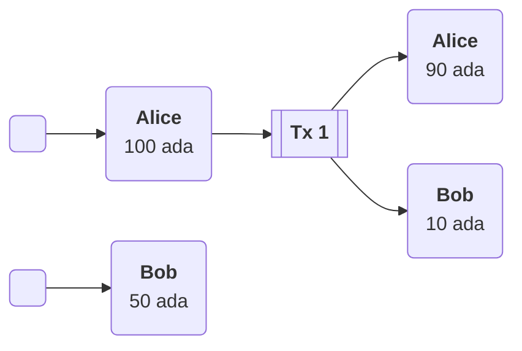
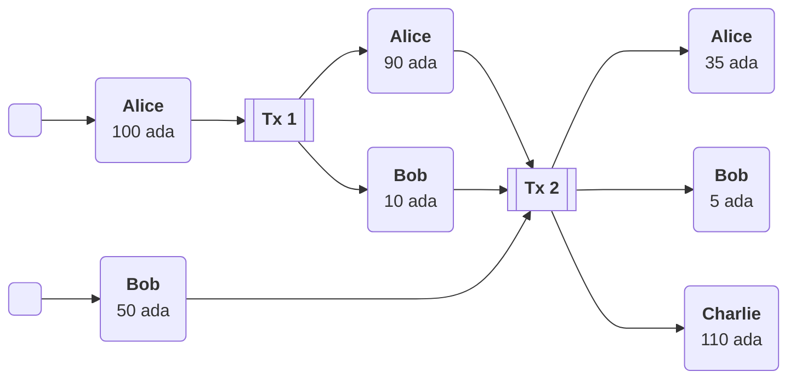
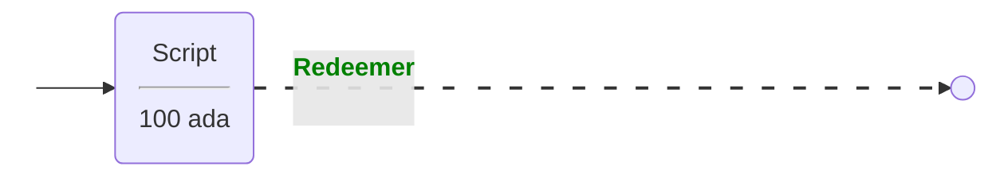
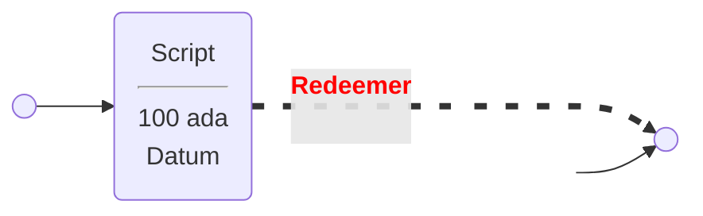
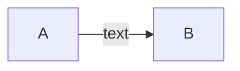
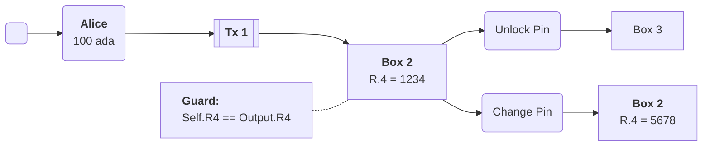

# PPP 030102 - The EUTxO-Model

## First Try

|Abbr.|Meaning|
|--|--|
|C|Connector|
|U|UTxO|
|T|Transaction|

## Second Try

## More Complex

## Script / Redeemer

The dotted link styling is a hack so we can use an invisible connector.

## Script / Datum / Redeemer

Demonstrate how to have a **label** on one end of the link.

## Text on connection

## Another Transaction

