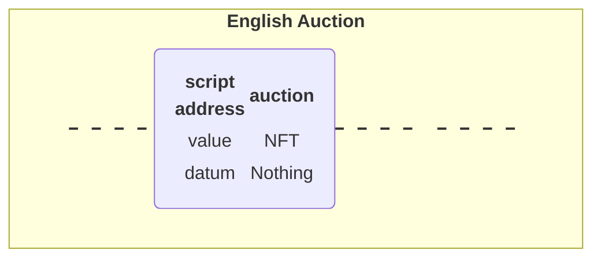
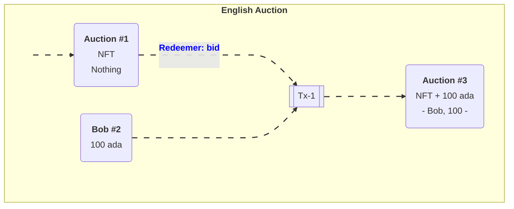
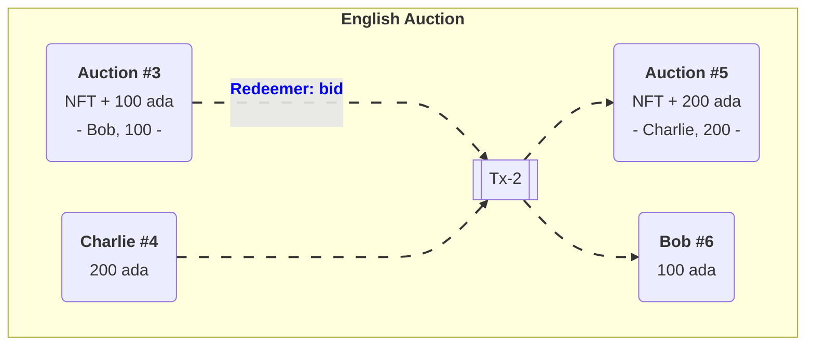

# English-Auction

based on: [PPP 030104 - Auction Contract in the EUTxO-Model](https://www.youtube.com/watch?v=Bj6bqRGT1L0)

So let’s say that Alice has an NFT and wants to auction it.
She creates an UTxO at the script output. We will look at the code later, but first we will just examine the ideas of the UTxO model.

- the **value** of the UTxO is the **NFT**
- and the **datum** is **Nothing**.  
Later on the **datum** will be the highest bidder and the highest bid.  
But right now, there hasn’t yet been a bid.

In the real blockchain you can’t have a UTxO that just contains native tokens, they always have to be accompanied by some Ada, but for simplicity we will ignore that here.

## Bob Makes a Bid

Not let’s say that Bob wants to bid 100 Ada.

In order to do this, Bob creates a transaction **Tx 1** with two inputs and one output.  
The first input is the **auction UTxO** and the second input is Bob’s bid of **100 ADA**.  
The output is, again, at the output script, but now the **value** and the **datum** has changed. Previously the **datum** was **Nothing** but now it is **(Bob, 100)**.

The value has changed because now there is not only the NFT in the UTxO, but also the 100 Ada bid.

As a **redeemer**, in order to unlock the original auction UTxO, we use something called **bid**. 
This is just an algebraic data type. There will be other values as well but one of those is **bid**. 
And the **auction script** will check that all the conditions are satisfied. 
So, in this case the script has to check that the **bid** happens before the deadline, and that the **bid** is high enough.

It also has to check that the correct inputs and outputs are present. In this case that means checking that the auction is an output containing the NFT and has the correct datum.

## Charlie Makes a Bid

Next, let’s assume that Charlie wants to outbid Bob and bid 200 Ada.

Charlie will create another transaction, this time one with two inputs and two outputs. As in the first case, the two inputs are the bid (this time Charlie’s bid of 200 Ada), and the auction UTxO. One of the outputs is the updated auction UTxO. There will also be a second output, which will be a UTxO which returns Bob’s bid of 100 Ada.

delete:

    %% Defining the UTxO's // align=Left funktioniert nicht
    U1( <table><tr><th>Auction</th></tr><tr><td>NFT </td></tr><tr><td>Nothing</td></tr></table> )
    U2( <table><tr><th>Bob</th></tr><tr><td>100 ada </td></tr></table> )

    %% Defining the Tx1 and its connections
    T1[[Tx-1]]

    C1 --> U1
    U1 -- 
<b>Redeemer: bid</b>  
 --- C2
    C2 --> T1
    U2 ---> T1

    %% Connect Tx-1 with Outputs 
    T1 ---> U3    