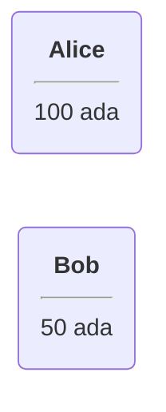
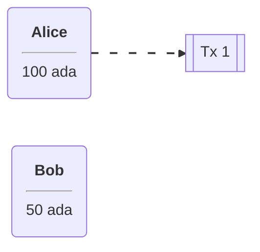
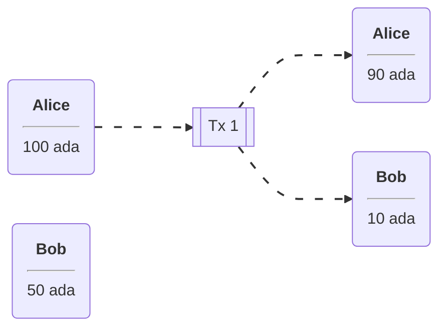
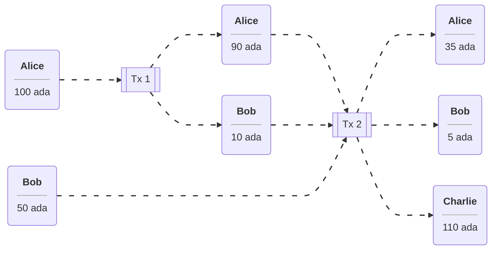
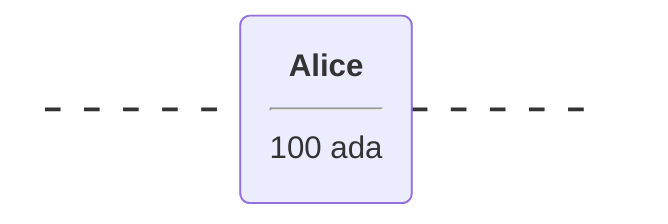
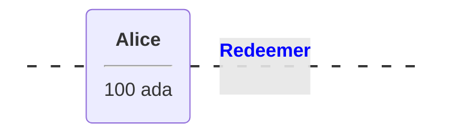
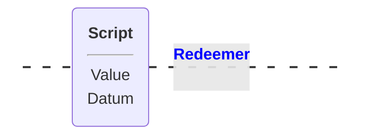
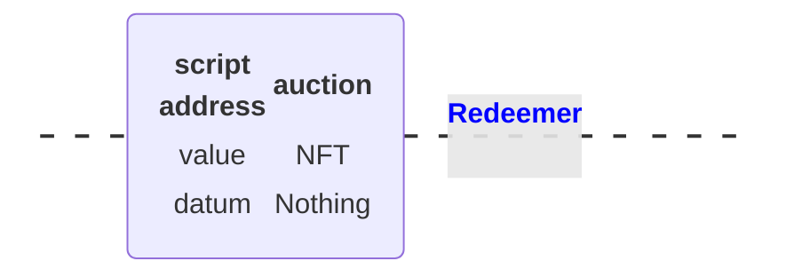
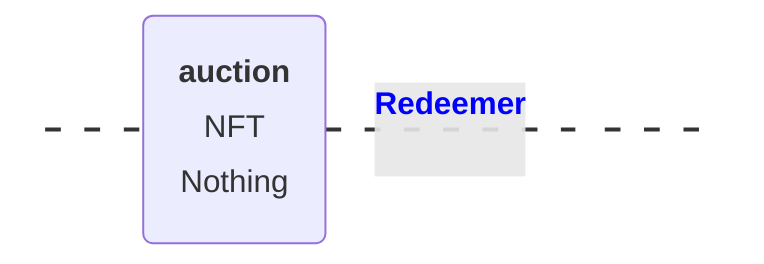

# Week 1

Let’s look at an example where we have two such **UTxO**s. One belonging to **Alice** of 100 Ada, and another belonging to **Bob** of 50 Ada.

Alice wants to send 10 ADA to Bob, so she needs to create a **transaction**.

> A **transaction** is something that contains an arbitrary number of inputs and an arbitrary number of outputs. The effect of a transaction is to consume inputs and produce new outputs.

The important thing is that you can only ever use complete UTxOs as input.
Alice cannot simply split her existing 100 ADA into a 90 and a 10,
she has to use the **full 100 ADA** as the **input** to a transaction.

She wants to pay 10 ADA to Bob, so one output will be 10 ADA (to Bob). She then wants her change back, so she creates a second output of 90 ADA (to herself). The full UTxO of 100 ADA has been spent, with Bob receiving a new transaction of 10 ADA, and Alice receiving the change of 90 ADA.

Alice's Transaction **generates two** new UTxOs

> In any transaction, the sum of the output values must match the sum of the input values.  
> Although, strictly speaking, this is not true.  
> There are two exceptions.
>
> - **Transaction fees**. In a real blockchain, you have to pay fees for each transactions.
> - **Native Tokens**. It’s possible for transactions to create new tokens, or to burn tokens, in which case the inputs will be lower or higher than the outputs, depending on the scenario.

Let’s take a look at a slightly more complicated example.

Alice and Bob want to transfer 55 ADA each to Charlie.

- Alice has no choice, as she only has one UTxO.
- Bob also has no choice as neither of his two UTxOs is large enough to cover the 55 ADA he wishes to send to Charlie.
- Bob will have to use both his UTxOs as input.

Alice and Bob Create a Transaction With Three Outputs

### When Is Spending Allowed?

Obviously it wouldn’t be a good idea if any transaction could spend arbitrary UTxOs. If that was the case then Bob could spend Alice’s money without her consent.

The way it works is by adding signatures to transactions.

In transaction 1, Alice’s signature has to be added to the transaction.
In transaction 2, both Alice and Bob need to sign the transaction.

Incidentally, this second, more complex, transaction cannot be done in Daedalus, so you would need to use the CLI for this.

Everything explained so far is just about the UTxO model, not the (E)UTxO model.

The extended part comes in when we talk about smart contracts, so in order to understand that,
let’s concentrate on the **consumption** of Alice’s UTxO of 100 ADA.

In the UTxO model, the **validation** that decides whether the **transaction** that this **input belongs to**
is allowed to **consume** the UTxO, relies on **digital signatures**.
In this case, that means that Alice has to sign the transaction in order for the **consumption** of the UTxO **to be valid**.

The idea of the (E)UTxO model is to make this more general.

Instead of having just **one condition**, namely that the appropriate signature is present in the transaction, we replace this with **arbitrary logic**.

### This is where Plutus comes in.

Instead of just having an **address** that corresponds to a **public key** that can be **verified** by a **signature** that is **added** to the **transaction**,
we have more **general addresses**, not based on public keys or the hashes of public keys,
but instead contain **arbitrary logic** which decides under which **conditions** a **particular UTxO** can be spent by a **particular transaction**.

So, instead of an input being validated simply by its public key,
the input will justify that it is allowed to consume this output with some arbitrary piece of data that we call the **Redeemer**.

> The **input** will justify that it is **allowed to be consumed** with some **arbitrary piece of data** that we call the **Redeemer**.

We replace the **public key address** (Alice’s in our example), with a **script**, and we replace the **digital signature** with a **Redeemer**.

## Script Context

### The Bitcoin approach

One option is that all the script sees is the Redeemer.
In this case, the Redeemer contains all the logic necessary to verify the transaction.
This is, incidentally, what Bitcoin does.

> In Bitcoin, there are smart contracts, but they are just not very smart.

They are called Bitcoin Script, which works exactly like this.
There is a **script** on the **UTxO side** and a **redeemer** on the **input side**, and
the **script** gets the **redeemer** and uses it to determine if it is ok to **consume the UTxO** or not.

But this is not the only option. We can decide to give more information to the script.

### The Ethereum approach

Ethereum uses a different concept.
In Ethereum, the **script can see everything** - the whole blockchain - the opposite extreme of Bitcoin.
In **Bitcoin**, the **script** has **very little context**, all it can see is **the redeemer**.
In **Ethereum**, the Solidity **scripts** can **see** the **complete state** of the blockchain.

This makes Ethereum scripts more powerful, but it also comes with problems.
Because the scripts are so powerful it is difficult to predict what a given script will do and
that opens the door to all sorts of security issues and dangers.
It is very hard for the developers of an Ethereum smart contract to predict everything that can happen.

### The Cardano approach

What Cardano does is something in the middle.

In **Plutus**, the script cannot see the whole blockchain, but it can **see** the **whole transaction** that is **being validated**.
In contrast to Bitcoin, it can’t see only the redeemer of the one input, but it can also see all the inputs and outputs of the transaction, and
the transaction itself. The Plutus script can use this information to decide whether it is ok to consume the output.

There is one last ingredient that Plutus scripts need in order to be as powerful and expressive as Ethereum scripts.
That is the so-called **Datum**. That is a piece of data that can be **associated with a UTxO** along with the **UTxO value**.

With this it is possible to prove mathematically that Plutus is at least as powerful
as the Ethereum model - any logic you can express in Ethereum can be expressed using the (E)UTxO model.

But it also has a lot of advantages compared to the Ethereum model.
For example, in Plutus, it is possible to check whether a transaction will validate in your wallet, before you ever send it to the chain.

Things can still go wrong with **off-chain** validation, however.
For example in the situation where you submit a transaction that has been validated in the wallet but gets rejected
when it attempts to consume an output **on-chain** that has already been consumed by another transaction.

In this case, your transaction will **fail without you having to pay any fees**.

But if all the inputs are still there that your transaction expects, then you can be sure that the transaction will validate and will have the predicted effect.

This is not the case with Ethereum. In Ethereum, the time between you constructing a transaction and
it being incorporated into the blockchain, a lot of stuff can happen concurrently, and
that is unpredictable and can have unpredictable effects on what will happen when your script finally executes.

In Ethereum it is always possible that you have to pay gas fees for a transaction
even if the transaction eventually fails with an error.
And that is guaranteed to never happen with Cardano.

In addition to that, it is also easier to analyse a Plutus script and to check, or even prove, that it is secure, because you don’t have to consider the whole state of the blockchain, which is unknowable. You can concentrate on this context that just consists of the spending transaction. So you have a much more limited scope and that makes it much easier to understand what a script is actually doing and what can possibly go wrong.

Who is responsible for providing the datum, redeemer and the validator?

The rule in Plutus is that the **spending transaction** has provide the **datum**, **redeemer** and the **validator**
whereas the **producing transaction** only has to provide hashes.

That means that if I produce an output that sits at a script address
then this **producing transaction** only has to include the **hash of the script** and
the **hash of the datum** that belongs to the output.
Optionally it can include the datum and the script as well.

If a **transaction** wants to **consume** such an **output** (UTxO).
then that **transaction** has to **provide** the **datum**, the **redeemer** and the **script**.
Which means that in order **to spend a given input**, you **need to know the datum**, because only the hash is publicly visible on the blockchain.

This is sometimes a problem and not what you want and that’s why you have the option to include the datum in the producing transaction.
If this were not possible, only people that knew the datum by some means other than looking at the blockchain would ever be able to spend such an output.

The (E)UTxO model is not tied to a particular programming language. What we have is Plutus, which is Haskell, but in principal you could use the same model with a completely different programming language, and we intend to write compilers for other programming languages to Plutus Script which is the “assembly” language underlying Plutus.

---> Next is: ### Running an example auction contract on a local Playground

<table>
  <tr><th>auction</th></tr>
  <tr><td>NFT</td></tr>
  <tr><td>Nothing</td></tr>
</table>

<table>
  <tr>
    <td><b>script address:</b></td>
    <td>auction</td>
  </tr>
  <tr>
    <td><b>value:</b></td>
    <td>NFT</td>
  </tr>
  <tr>
    <td><b>datum:</b></td>
    <td>Nothing</td>
  </tr>        
</table>

## Format for UTxO in diagram

