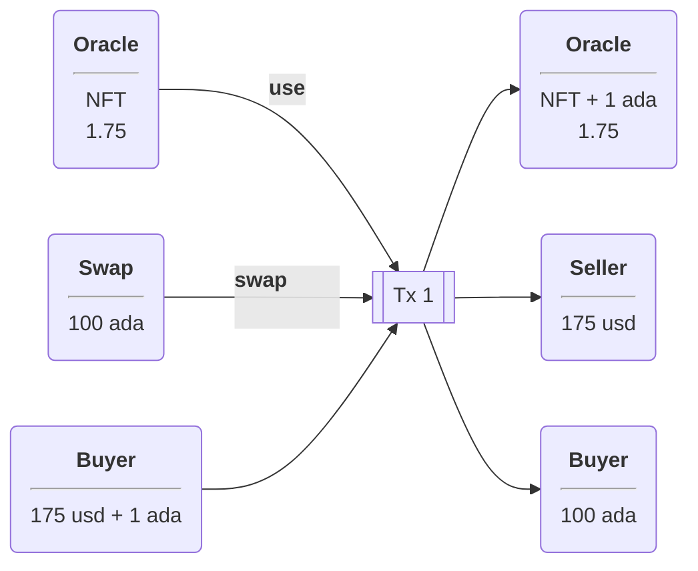
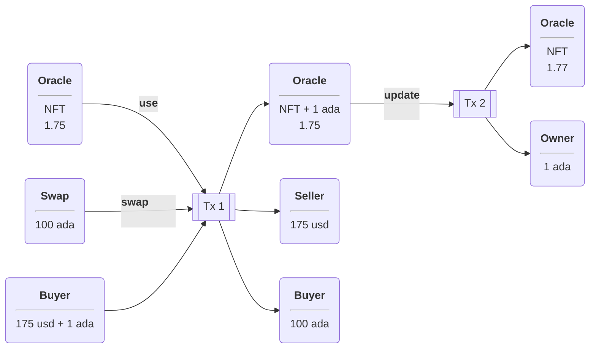
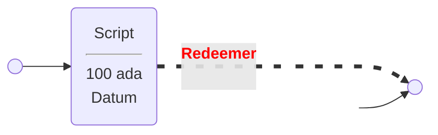

# adacapo21/plutusPioneerProgram/PLUTUS PIONEER PROGRAM COHORT 2

Based on: [Oracle Core](https://github.com/adacapo21/plutusPioneerProgram/blob/main/week6Documentation.md)

Attempt to reproduce the diagram using `mermaid` syntax.

## Oracle

## Swap

Another attempt:

