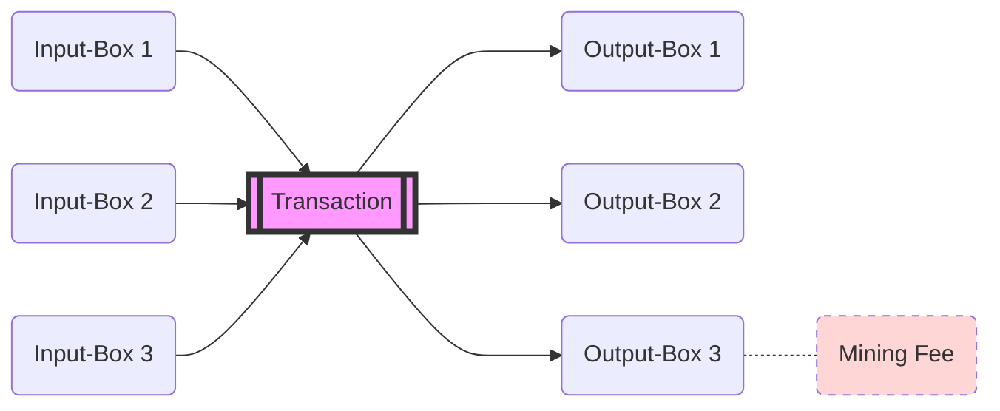
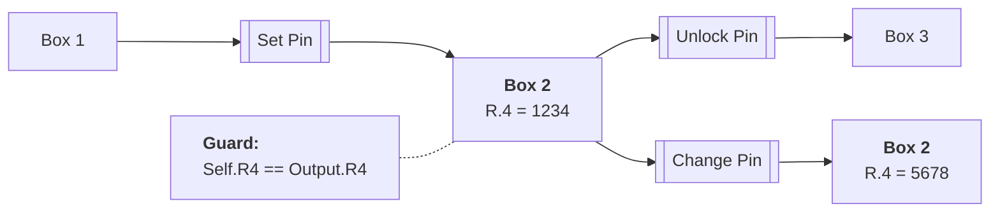

# Class 1

[Video](https://youtu.be/pMVfTEgqyTc)

- ErgoScript Class 1
  - Txs
  - Examples
  - GuardScript / ErgoScript
  - Technical Knowledge

## Transaction

- models the outputs
- if all input boxes can be spent then the `Tx` goes through
- all Inputs must been spent

