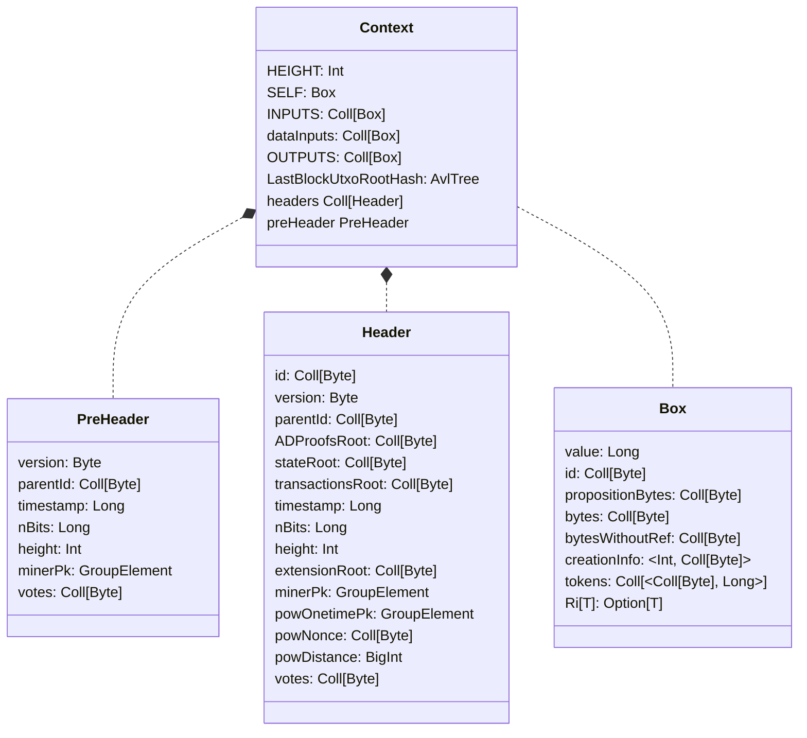

# Context

Based on [ErgoScript Language Description](https://github.com/ScorexFoundation/sigmastate-interpreter/blob/develop/docs/LangSpec.md), you can derive this conceptual class diagram:

```mermaid
classDiagram
direction TD


class Context{
  HEIGHT: Int 
  SELF: Box 
  INPUTS: Coll[Box] 
  dataInputs: Coll[Box] 
  OUTPUTS: Coll[Box]
  LastBlockUtxoRootHash: AvlTree 
  headers Coll[Header] 
  preHeader PreHeader 
}

class Box{
  value: Long 
  id: Coll[Byte] 
  propositionBytes: Coll[Byte]
  bytes: Coll[Byte]
  bytesWithoutRef: Coll[Byte]
  creationInfo: ~Int, Coll[Byte]~ 
  tokens: Coll[~Coll[Byte], Long~] 
  Ri[T]: Option[T]
}

class Header {  
  id: Coll[Byte]
  version: Byte 
  parentId: Coll[Byte] 
  ADProofsRoot: Coll[Byte] 
  stateRoot: Coll[Byte] 
  transactionsRoot: Coll[Byte] 
  timestamp: Long 
  nBits: Long
  height: Int 
  extensionRoot: Coll[Byte] 
  minerPk: GroupElement 
  powOnetimePk: GroupElement 
  powNonce: Coll[Byte] 
  powDistance: BigInt 
  votes: Coll[Byte] 
}

class PreHeader { 
  version: Byte 
  parentId: Coll[Byte] 
  timestamp: Long 
  nBits: Long 
  height: Int 
  minerPk: GroupElement 
  votes: Coll[Byte] 
}

Context *.. PreHeader
Context *.. Header
Context .. Box
```

