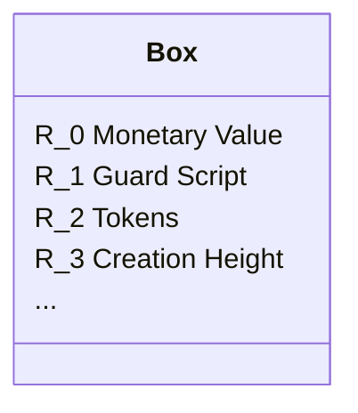
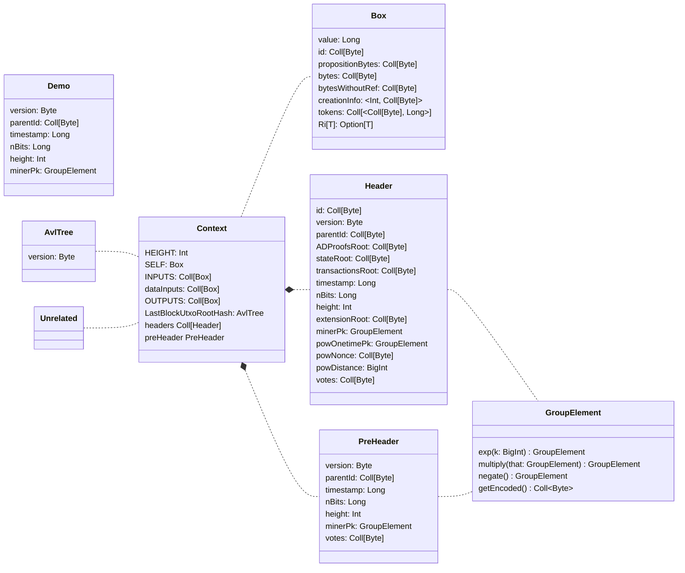
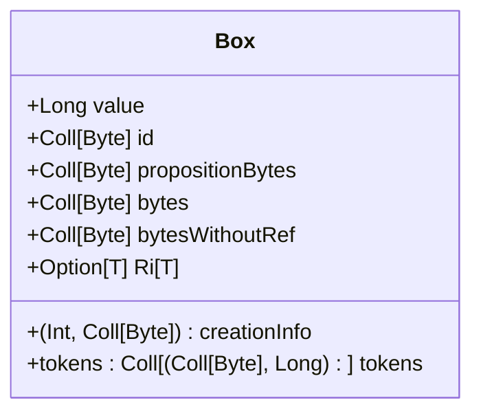
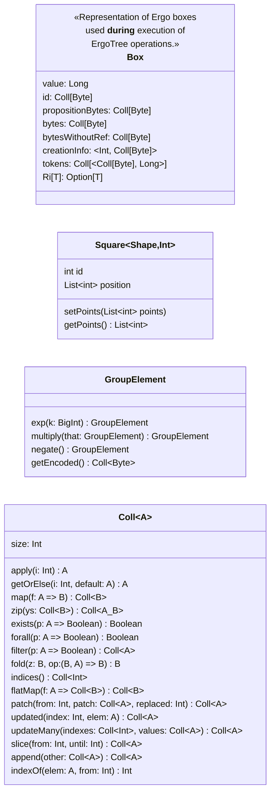

# Data Model

## Box Format

based on: [Data Model/Box](https://docs.ergoplatform.com/dev/data-model/box/)

A box is made of registers (and nothing but registers!), we allow every box in the system to have up to 10 registers. We denote the registers as R_0,R_1,...,R_9. 




From these registers, four are filled with mandatory values: 

| Register | Meaning |
| -- | -- |
| **R_0** | monetary value |
| **R_1** | serialized guard script / protecting script |
| **R_2** | tokens |
| **R_3** | 
- declared **creation height**, 
- **unique identifier of transaction** which created the coin and 
- also an **index of the box in the transaction**. <br />
___Or___
- identifier of a transaction which created the box and 
- output index in the transaction and 
- also creation height.
|


<details>
  <summary>What does the register <b>R_0</b> stands for?</summary>

monetary value

</details>

<details>
  <summary>What does the register <b>R_1</b> stands for?</summary>

serialized guard script / protecting script

</details>

<details>
  <summary>What does the register <b>R_2</b> stands for?</summary>

tokens

</details>

<details>
  <summary>What does the register <b>R_3</b> stands for?</summary>
  
- declared **creation height**, 
- **unique identifier of transaction** which created the coin and 
- also an **index of the box in the transaction**. <br />
___Or___
- identifier of a transaction which created the box and 
- output index in the transaction and 
- also creation height.

</details>

<br />
<br />
---

As an example of a box. We take the proof-of-no-premine from Ergo genesis state, which contains last block ids from Bitcoin and Ethereum at the moment of launch, and also latest news headlines:

```json
     {
    "boxId": "b8ce8cfe...",
    "value": 1000000000,
    "ergoTree": "10010100d17300",
    "assets": [],
    "creationHeight": 0,
    "additionalRegisters": {
      "R4": "0e403030...",      
      "R5": "0e423078...",
      "R6": "0e464272...",
      "R7": "0e54e8bf...",
      "R8": "0e45d094..."
    }
  }
```


https://ergoplatform.org/en/blog/2021-06-09-building-ergo-ergoscript/

https://www.ergoforum.org/t/ergoscript-design-patterns/222



## Types

```json
/** Represents data available in ErgoScript using `CONTEXT` global variable */
class Context {
  /** Height (block number) of the block which is currently being validated. */
  def HEIGHT: Int
  
  /** Box whose proposition is being currently executing */
  def SELF: Box
  
  /** A collection of inputs of the current transaction, the transaction where
    * selfBox is one of the inputs. 
    */
  def INPUTS: Coll[Box]
  
  /** A collection of data inputs of the current transaction. Data inputs are
    * not going to be spent and thus don't participate in transaction validation
    * as `INPUTS`, but data boxes are available in guarding propositions of
    * `INPUTS` and thus can be used in spending logic.
    */
  def dataInputs: Coll[Box]
  
  /** A collection of outputs of the current transaction. */
  def OUTPUTS: Coll[Box]
  
  /** Authenticated dynamic dictionary digest representing Utxo state before
    * current state. 
    */
  def LastBlockUtxoRootHash: AvlTree
  
  /** A fixed number of last block headers in descending order (first header is
    * the newest one) 
    */
  def headers: Coll[Header]

  /** Header fields that are known before the block is mined. */
  def preHeader: PreHeader  
}

/** Represents data of the block headers available in scripts. */
class Header {  
  /** Bytes representation of ModifierId of this Header */
  def id: Coll[Byte]

  /** Block version, to be increased on every soft and hardfork. */
  def version: Byte
  
  /** Id of parent block (as bytes) */
  def parentId: Coll[Byte] // 
  
  /** Hash of ADProofs for transactions in a block */
  def ADProofsRoot: Coll[Byte] // Digest32. Can we build AvlTree out of it? 

  /** AvlTree) of a state after block application */
  def stateRoot: Coll[Byte]  // ADDigest  //33 bytes! extra byte with tree height here!

  /** Root hash (for a Merkle tree) of transactions in a block. */
  def transactionsRoot: Coll[Byte]  // Digest32

  /** Block timestamp (in milliseconds since beginning of Unix Epoch) */
  def timestamp: Long

  /** Current difficulty in a compressed view.
    * NOTE: actually it is unsigned Int*/
  def nBits: Long  // actually it is unsigned Int 

  /** Block height */
  def height: Int

  /** Root hash of extension section (Digest32) */
  def extensionRoot: Coll[Byte]

  /** Miner public key. Should be used to collect block rewards.
    * Part of Autolykos solution (pk). 
    */
  def minerPk: GroupElement

  /** One-time public key. Prevents revealing of miners secret. 
    * Part of Autolykos solution (w). 
    */
  def powOnetimePk: GroupElement

  /** Nonce value found by the miner. Part of Autolykos solution (n). */
  def powNonce: Coll[Byte]

  /** Distance between pseudo-random number, corresponding to nonce `powNonce`
    * and a secret, corresponding to `minerPk`. The lower `powDistance` is, the
    * harder it was to find this solution. 
    * Part of Autolykos solution (d).
    */
  def powDistance: BigInt

  /** Miner votes for changing system parameters. */
  def votes: Coll[Byte]
}

/** Only header fields that can be predicted by a miner. */
class PreHeader { 
  /** Block version, to be increased on every soft and hardfork. */
  def version: Byte

  /** Id of parent block */
  def parentId: Coll[Byte] // ModifierId

  /** Block timestamp (in milliseconds since beginning of Unix Epoch) */
  def timestamp: Long

  /** Current difficulty in a compressed view.
    * NOTE: actually it is 32-bit unsigned Int */
  def nBits: Long

  /** Block height */
  def height: Int

  /** Miner public key. Should be used to collect block rewards. */
  def minerPk: GroupElement

  /** Miner votes for changing system parameters. */
  def votes: Coll[Byte]
}
```

### Box



- Box with unusual Syntax




```json
/** Representation of Ergo boxes used during execution of ErgoTree operations. */
class Box {
  /** Box monetary value in NanoErg */
  def value: Long 
  
  /** Blake2b256 hash of this box's content, basically equals to
    * `blake2b256(bytes)` 
    */
  def id: Coll[Byte] 

  /** Serialized bytes of guarding script, which should be evaluated to true in
    * order to open this box. 
    */
  def propositionBytes: Coll[Byte] 
  
  /** Serialized bytes of this box's content, including proposition bytes. */
  def bytes: Coll[Byte] 
  
  /** Serialized bytes of this box's content, excluding transactionId and index
    * of output. 
    */
  def bytesWithoutRef: Coll[Byte]
    
  /** If `tx` is a transaction which generated this box, then `creationInfo._1`
    * is a height of the tx's block. The `creationInfo._2` is a serialized
    * transaction identifier followed by box index in the transaction outputs.
    */
  def creationInfo: (Int, Coll[Byte]) 
  
  /** Synonym of R2 obligatory register */
  def tokens: Coll[(Coll[Byte], Long)] 
  
  /** Extracts register by id and type.
    * ErgoScript is typed, so accessing a register is an operation which involves some
    * expected type given in brackets. Thus `SELF.R4[Int]` expression should evaluate to a
    * valid value of the `Option[Int]` type.
    *
    * For example `val x = SELF.R4[Int]` expects the
    * register, if it is present, to have type `Int`. At runtime the corresponding type
    * descriptor is passed as `implicit t: RType[T]` parameter of `getReg` method and
    * checked against the actual value of the register.
    *
    * There are three cases:
    * 1) If the register doesn't exist.
    *   Then `val x = SELF.R4[Int]` succeeds and returns the None value, which conforms to
    *   any value of type `Option[T]` for any T. (In the example above T is equal to
    *   `Int`). Calling `x.get` fails when x is equal to None, but `x.isDefined`
    *   succeeds and returns `false`.
    * 2) If the register contains a value `v` of type `Int`.
    *   Then `val x = SELF.R4[Int]` succeeds and returns `Some(v)`, which is a valid value
    *   of type `Option[Int]`. In this case, calling `x.get` succeeds and returns the
    *   value `v` of type `Int`. Calling `x.isDefined` returns `true`.
    * 3) If the register contains a value `v` of type T other then `Int`.
    *   Then `val x = SELF.R4[Int]` fails, because there is no way to return a valid value
    *   of type `Option[Int]`. The value of register is present, so returning it as None
    *   would break the typed semantics of registers collection.
    *
    * In some use cases one register may have values of different types. To access such
    * register an additional register can be used as a tag.
    *
    * <pre class="stHighlight">
    *   val tagOpt = SELF.R5[Int]
    *   val res = if (tagOpt.isDefined) {
    *     val tag = tagOpt.get
    *     if (tag == 1) {
    *       val x = SELF.R4[Int].get
    *       // compute res using value x is of type Int
    *     } else if (tag == 2) {
    *       val x = SELF.R4[GroupElement].get
    *       // compute res using value x is of type GroupElement
    *     } else if (tag == 3) {
    *       val x = SELF.R4[ Array[Byte] ].get
    *       // compute res using value x of type Array[Byte]
    *     } else {
    *       // compute `res` when `tag` is not 1, 2 or 3
    *     }
    *   }
    *   else {
    *     // compute value of res when register is not present
    *   }
    * </pre>
    *
    * @param i zero-based identifier of the register.
    * @tparam T expected type of the register.
    * @return Some(value) if the register is defined AND has the given type.
    *         None otherwise
    * @throws special.sigma.InvalidType exception when the type of the register value is
    *                                   different from T.
    */
  def Ri[T]: Option[T]
}
```