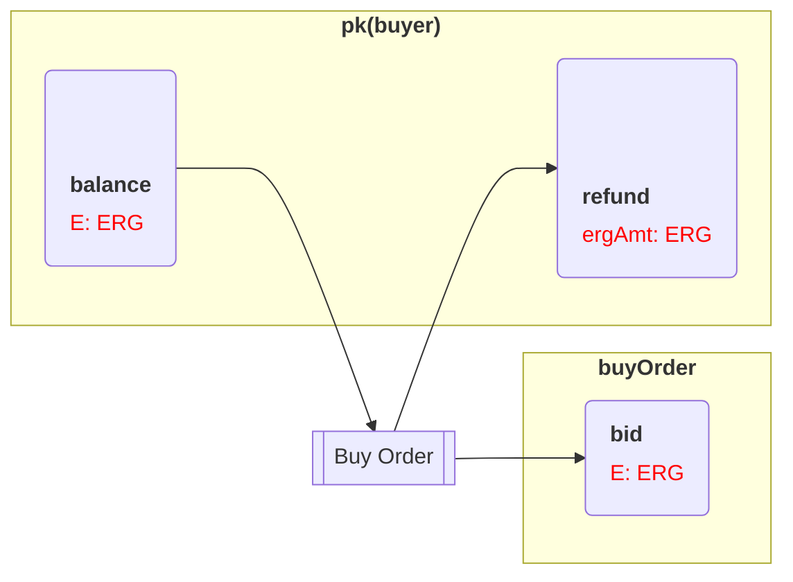
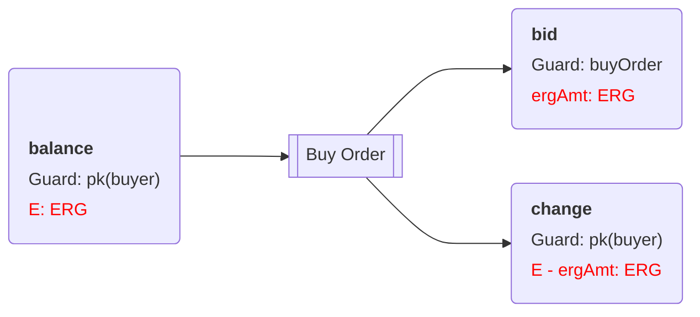
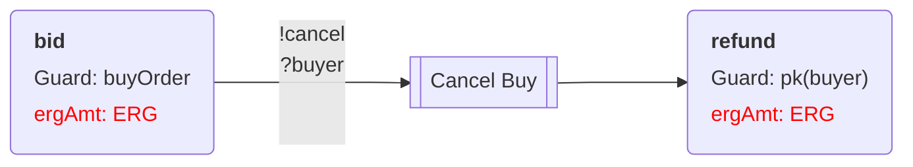

# DEX dApp FlowCard

https://stackoverflow.com/questions/66631182/can-i-control-the-direction-of-flowcharts-in-mermaid

The following diagram fully (and formally) specifies all of the five transactions that must be created **off-chain** by the DEX dApp. It also specifies all of the spending conditions that should be verified **on-chain**.

## Buy Order Transaction

A buyer creates a `Buy Order` transaction. The transaction spends `E` amount of ERGs (which we will write `E: ERG`) from one or more boxes in the `pk(buyer)` wallet. The transaction creates a `bid` box with `ergAmt: ERG` protected by the `buyOrder` script. 

The `change` box is created to make the input and output sums of the transaction balanced.

## Cancel Buy, Cancel Sell Transactions

At any time, the `buyer` can cancel the order by sending `CancelBuy` transaction. The transaction should satisfy the guarding `buyOrder` contract which protects the `bid` box. 

As you can see on the diagram, both the `Cancel` and the `Swap` transactions can spend the `bid` box. 

When a box has spending alternatives (or spending paths) then each alternative is identified by a unique name prefixed with `!` (`!cancel` and `!swap` for the `bid` box). Each alternative path has specific spending conditions. 

In our example, when the `Cancel Buy` transaction spends the `bid` box the `?buyer` condition should be satisfied, which we read as “**the signature for the buyer address should be presented in the transaction**”. Therefore, only buyer can cancel the buy order. This “signature” condition is only required for the `!cancel` alternative spending path and not required for `!swap`.

