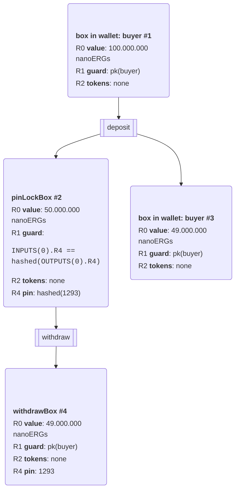

# Pin Lock Contract

## depositTransaction

- input boxes 

inputs = selectUnspentBoxes(toSpend = userFunds)

- output box : pinLockBox 

| meaning      | Register | content                               |
| ------------ | -------- | ------------------------------------- |
| value        | R1       | userFunds/2                           |
| guard script | R2       | INPUTS(0).R4 == hashed(OUTPUTS(0).R4) |
|              | R4       | hashedPin                             |

- depositTransaction

```
val depositTransaction = Transaction(
      inputs       = userParty.selectUnspentBoxes(toSpend = userFunds),
      outputs      = List(pinLockBox),
      fee          = MinTxFee,
      sendChangeTo = userParty.wallet.getAddress
    )
```


