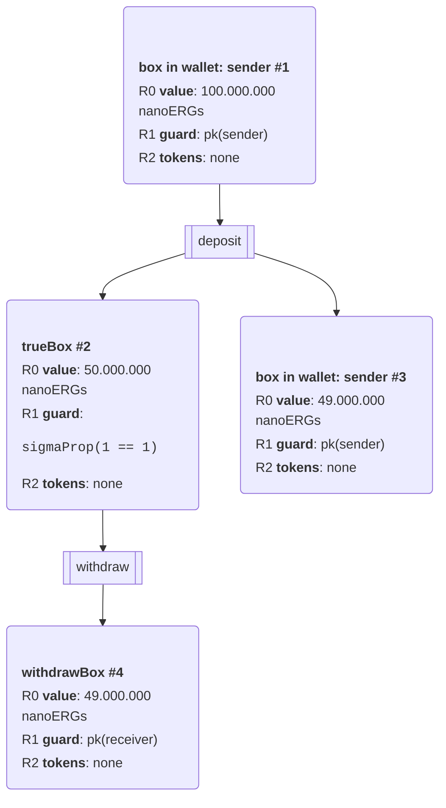

# Simple Send

- see: [ErgoScript Example](https://github.com/ergoplatform/ergoscript-by-example/blob/main/simpleSend.md)

```mermaid
flowchart TD

  %% adjust margin-top: lines = 5; margin-top -12ex --> (lines-1) * 3 ex
  box1("<table style='text-align:left; margin-top: -9ex; margin-bottom: 0;' > 
    <tr><th><b>box in wallet: sender #1</b></th></tr> 
    <tr><td>R0 <b>value</b>: 100.000.000 nanoERGs</td></tr>     
    <tr><td>R1 <b>guard</b>: pk(sender)</td></tr> 
    <tr><td>R2 <b>tokens</b>: none</td></tr> 
    </table>")

  %% adjust margin-top: lines = 5; margin-top -12ex --> (lines-1) * 3 ex
  box2("<table style='text-align:left; margin-top: -11ex; margin-bottom: 0;' > 
    <tr><th><b>trueBox #2</b></th></tr> 
    <tr><td >R0 <b>value</b>: 50.000.000 nanoERGs</td></tr> 
    <tr><td >R1 <b>guard</b>: <br/><pre>sigmaProp(1 == 1)</pre></td></tr> 
    <tr><td>R2 <b>tokens</b>: none</td></tr> 
    </table>  ")

  box3("<table style='text-align:left; margin-top: -9ex; margin-bottom: 0;' > 
    <tr><th><b>box in wallet: sender #3</b></th></tr> 
    <tr><td>R0 <b>value</b>: 49.000.000 nanoERGs</td></tr>     
    <tr><td>R1 <b>guard</b>: pk(sender)</td></tr> 
    <tr><td>R2 <b>tokens</b>: none</td></tr> 
    </table>")

  %% adjust margin-top: lines = 5; margin-top -12ex --> (lines-1) * 3 ex
  box4("<table style='text-align:left; margin-top: -11ex; margin-bottom: 0;' > 
    <tr><th><b>withdrawBox #4</b></th></tr> 
    <tr><td>R0 <b>value</b>: 49.000.000 nanoERGs</td></tr> 
    <tr><td>R1 <b>guard</b>: pk(receiver)</td></tr> 
    <tr><td>R2 <b>tokens</b>: none</td></tr>     
    </table>  ")


  Tx1[["deposit"]]
  Tx2[["withdraw"]]


  box1 --> Tx1
  Tx1 --> box2
  Tx1 --> box3
  box2 --> Tx2 --> box4

```

