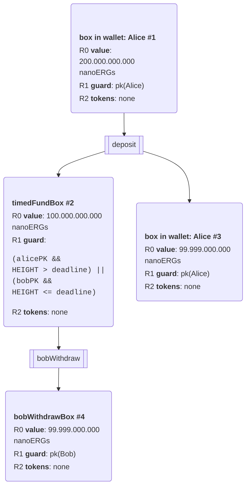

# Time Funed ConTract

- 1 Erg = 1.000.000.000 nanoErgs

```mermaid
flowchart TD

  %% adjust margin-top: lines = 5; margin-top -12ex --> (lines-1) * 3 ex
  box1("<table style='text-align:left; margin-top: -9ex; margin-bottom: 0;' > 
    <tr><th><b>box in wallet: Alice #1</b></th></tr> 
    <tr><td>R0 <b>value</b>: 200.000.000.000 nanoERGs</td></tr>     
    <tr><td>R1 <b>guard</b>: pk(Alice)</td></tr> 
    <tr><td>R2 <b>tokens</b>: none</td></tr> 
    </table>")

  %% adjust margin-top: lines = 5; margin-top -12ex --> (lines-1) * 3 ex
  box2("<table style='text-align:left; margin-top: -11ex; margin-bottom: 0;' > 
    <tr><th><b>timedFundBox #2</b></th></tr> 
    <tr><td >R0 <b>value</b>: 100.000.000.000 nanoERGs</td></tr> 
    <tr><td >R1 <b>guard</b>: <br/><pre>(alicePK && 
HEIGHT > deadline) ||
(bobPK && 
HEIGHT <= deadline)</pre></td></tr> 
    <tr><td>R2 <b>tokens</b>: none</td></tr> 
    </table>  ")

  box3("<table style='text-align:left; margin-top: -9ex; margin-bottom: 0;' > 
    <tr><th><b>box in wallet: Alice #3</b></th></tr> 
    <tr><td>R0 <b>value</b>: 99.999.000.000 nanoERGs</td></tr>     
    <tr><td>R1 <b>guard</b>: pk(Alice)</td></tr> 
    <tr><td>R2 <b>tokens</b>: none</td></tr> 
    </table>")

  %% adjust margin-top: lines = 5; margin-top -12ex --> (lines-1) * 3 ex
  box4("<table style='text-align:left; margin-top: -11ex; margin-bottom: 0;' > 
    <tr><th><b>bobWithdrawBox #4</b></th></tr> 
    <tr><td>R0 <b>value</b>: 99.999.000.000 nanoERGs</td></tr> 
    <tr><td>R1 <b>guard</b>: pk(Bob)</td></tr> 
    <tr><td>R2 <b>tokens</b>: none</td></tr>     
    </table>  ")


  Tx1[["deposit"]]
  Tx2[["bobWithdraw"]]


  box1 --> Tx1
  Tx1 --> box2
  Tx1 --> box3
  box2 --> Tx2 --> box4

```