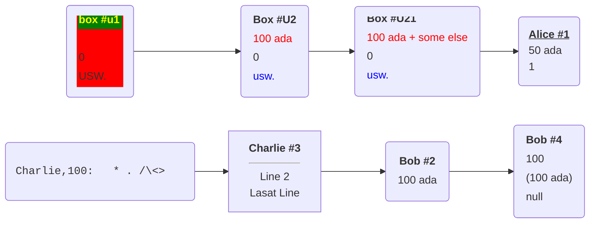

Based on [Data Model/Box](https://docs.ergoplatform.com/dev/data-model/box/)
a box is made up of registers (and nothing but registers!), we allow every box in the system to have up to 10 registers. We denote the registers as R_0,R_1,...,R_9. 

From these registers, four are filled with mandatory values: 

| Register | Meaning |
| -- | -- |
| **R_0** | monetary value |
| **R_1** | serialized guard script / protecting script |
| **R_2** | tokens |
| **R_3** | 
- declared **creation height**, 
- **unique identifier of transaction** which created the coin and 
- also an **index of the box in the transaction**.  
___Or___
- identifier of a transaction which created the box and 
- output index in the transaction and 
- also creation height.
|

❩

Medium Left Parenthesis Ornament
&#10088;   &#x2768;

Medium Right Parenthesis Ornament
&#10089; &#x2769;

