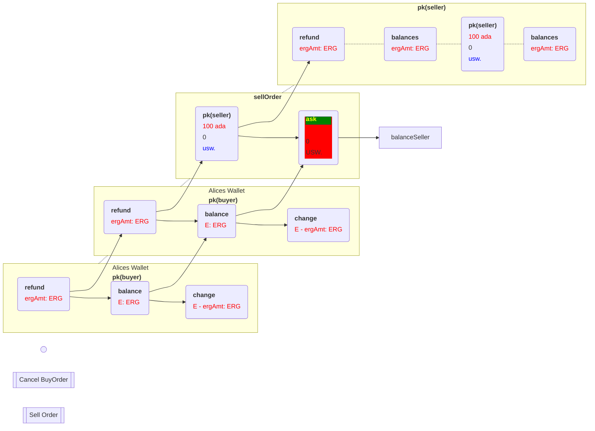

```mermaid
flowchart LR


    %% Placeholder 1
    PH1((" "))

    %% Alices Wallet
    subgraph SUB1["Alices Wallet<br/><b>pk(buyer)</b>"]
      direction TB 

      %% adjust margin-top: lines = 4; margin-top -9ex --> (lines-1) * 3 ex
      refund("<table style='text-align:left; margin-top: -9ex; margin-bottom: 0;' > 
        <tr><th '><b>refund</b></th></tr> 
        <tr><td style='color:red'>ergAmt: ERG</td></tr> 
        </table>  ")

      balance("<table style='text-align:left; margin-top: -9ex; margin-bottom: 0;' > 
        <tr><th '><b>balance</b></th></tr> 
        <tr><td style='color:red'>E: ERG</td></tr> 
        </table>  ")

      change("<table style='text-align:left; margin-top: -9ex; margin-bottom: 0;' > 
        <tr><th '><b>change</b></th></tr> 
        <tr><td style='color:red'>E - ergAmt: ERG</td></tr> 
        </table>  ")

      %% positional connections 
      refund --> balance --> change
    end 

    subgraph SUB2["Alices Wallet<br/><b>pk(buyer)</b>"]
      direction TB

      %% adjust margin-top: lines = 4; margin-top -9ex --> (lines-1) * 3 ex
      refund2("<table style='text-align:left; margin-top: -9ex; margin-bottom: 0;' > 
        <tr><th '><b>refund</b></th></tr> 
        <tr><td style='color:red'>ergAmt: ERG</td></tr> 
        </table>  ")

      balance2("<table style='text-align:left; margin-top: -9ex; margin-bottom: 0;' > 
        <tr><th '><b>balance</b></th></tr> 
        <tr><td style='color:red'>E: ERG</td></tr> 
        </table>  ")

      change2("<table style='text-align:left; margin-top: -9ex; margin-bottom: 0;' > 
        <tr><th '><b>change</b></th></tr> 
        <tr><td style='color:red'>E - ergAmt: ERG</td></tr> 
        </table>  ")

      %% positional connections 
      refund2 --> balance2 --> change2
    end 

    %% Bobs Wallet
    subgraph SUB3["<b>sellOrder</b>"]
      direction TB

      %% adjust margin-top: lines = 7; margin-top -18ex --> (lines-1) * 3 ex
      BW("<table style='text-align:left; margin-top: -18ex; margin-bottom: 0;' > 
        <tr><th >pk(seller)</th></tr> 

        <tr><td style='color:red'>100 ada</td></tr> 
        <tr><td>0</td></tr>     
        <tr style='color: blue; ' ><td>usw.</td></tr> 
        </table>  ")

      %% Defining the UTxO's
      ask("<table style='text-align:left; text-transform: uppercase; background-color: red; margin-top: -6.5rem; margin-botom: 120px' > 
        <tr style='background-color: blue'><th  style='color: yellow; text-transform: lowercase; background-color: green;'>ask</th></tr> 
        <tr><td style='color:red'>100 ada</td></tr> 
        <tr><td>0</td></tr> 
        <tr><td>usw.</td></tr> </table> 
      ")

      BW --> ask

    end

    subgraph SUB4["<b>pk(seller)</b>"]
      direction BT 

      %% adjust margin-top: lines = 4; margin-top -9ex --> (lines-1) * 3 ex
      refundSeller("<table style='text-align:left; margin-top: -9ex; margin-bottom: 0;' > 
        <tr><th '><b>refund</b></th></tr> 
        <tr><td style='color:red'>ergAmt: ERG</td></tr> 
        </table>  ")

      balancesSeller("<table style='text-align:left; margin-top: -9ex; margin-bottom: 0;' > 
        <tr><th '><b>balances</b></th></tr> 
        <tr><td style='color:red'>ergAmt: ERG</td></tr> 
        </table>  ")

      %% adjust margin-top: lines = 7; margin-top -18ex --> (lines-1) * 3 ex
      changeSeller("<table style='text-align:left; margin-top: -18ex; margin-bottom: 0;' > 
        <tr><th >pk(seller)</th></tr> 

        <tr><td style='color:red'>100 ada</td></tr> 
        <tr><td>0</td></tr>     
        <tr style='color: blue; ' ><td>usw.</td></tr> 
        </table>  ")

      sellerOutSeller("<table style='text-align:left; margin-top: -9ex; margin-bottom: 0;' > 
        <tr><th '><b>balances</b></th></tr> 
        <tr><td style='color:red'>ergAmt: ERG</td></tr> 
        </table>  ")

      %% positional connections 
      refundSeller -.- balancesSeller -.- changeSeller -.- sellerOutSeller  
      

    end  

    

  %% Buy Order Transaction
  %% TBo[[BuyOrder Transaction]]
  
  %% Cancel Buy Order Transaction
  TCBo[[Cancel BuyOrder]]
  
  TSo[["Sell Order"]]
  
  %%balancesSeller --> ask

  SUB1 -.- SUB2 -.- SUB3 -.- SUB4
  balance --> balance2 --> ask --> balanceSeller
  refund --> refund2 --> BW --> refundSeller

```
