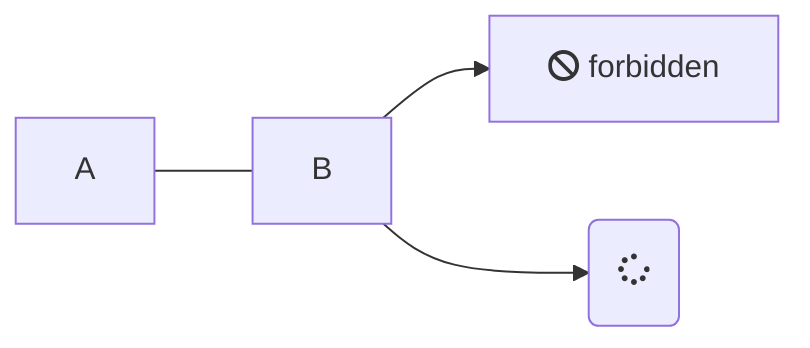

# Graph Examples

based on: https://markdownmonster.west-wind.com/docs/_5ef0x96or.htm

- FontAwesome does not work inside VSCode

graph LR
  A --- B
  B-->C[fa:fa-ban forbidden]
  B-->D(fa:fa-spinner);

## Graph

